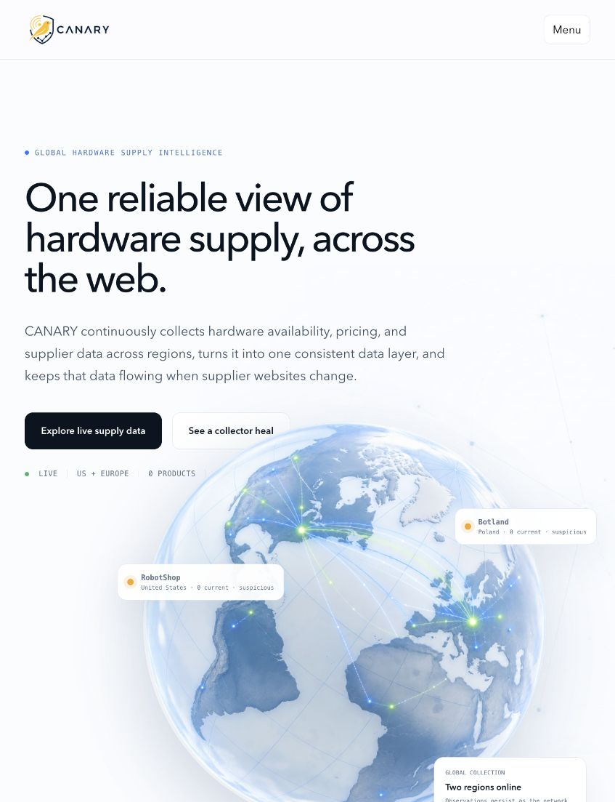
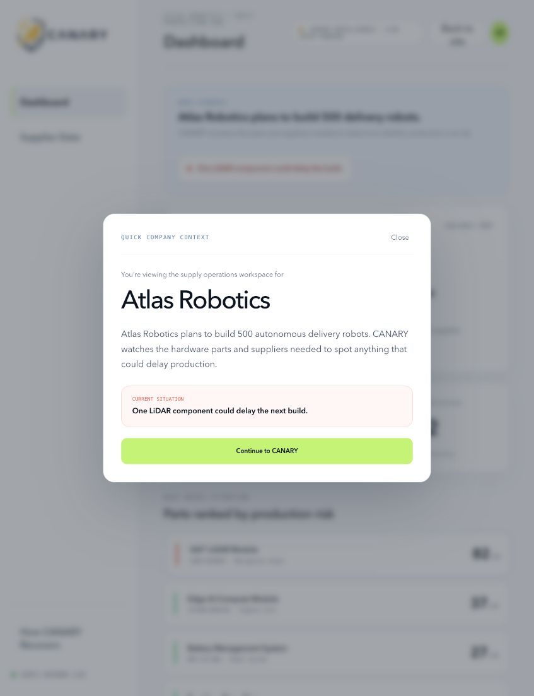
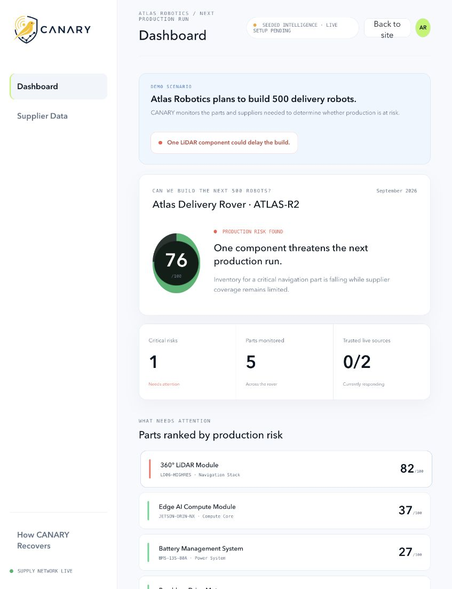
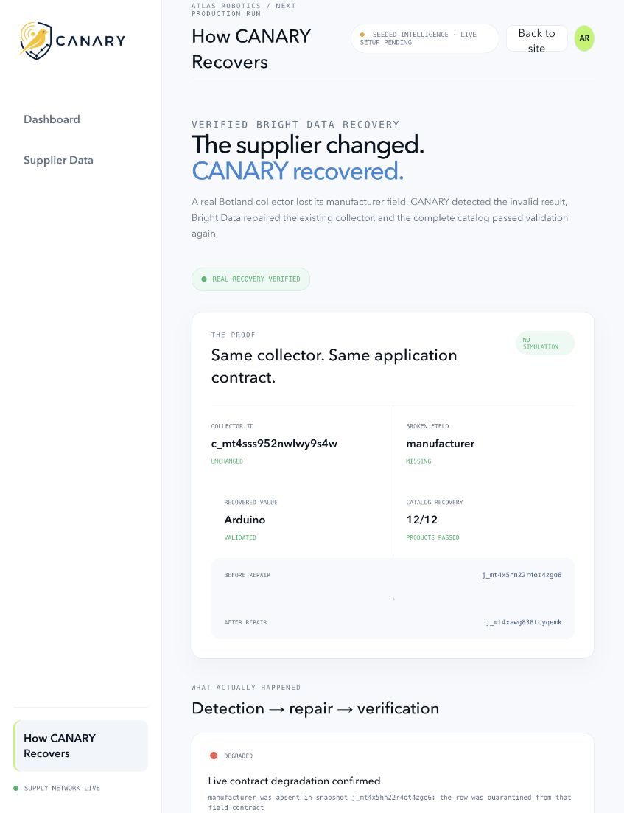
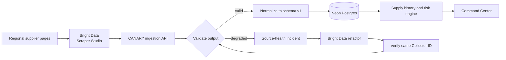

<p align="center">
  
</p>

<h1 align="center">CANARY</h1>

<p align="center">
  <strong>One reliable view of hardware supply, across the web.</strong>
</p>

<p align="center">
  CANARY collects hardware availability, pricing, and supplier data across regions, normalizes it into one dependable data layer, and keeps that data flowing when supplier websites change.
</p>

<p align="center">
  <a href="https://canary-supply-intelligence.vercel.app">Live demo</a> ·
  <a href="#how-canary-uses-bright-data-scraper-studio">Bright Data integration</a> ·
  <a href="#run-locally">Run locally</a>
</p>



## The concept

Hardware teams depend on parts sold across manufacturers, regional distributors, and specialist stores. Every source uses different formats, currencies, availability language, and page structures. A website change can silently break the data feeding a purchasing or production decision.

CANARY turns that fragmented web into a stable hardware-supply API. It continuously collects supplier evidence, validates and normalizes each observation, preserves history, detects extraction degradation, and can repair and verify an existing collector without changing its ID or downstream contract.

The product is demonstrated through **Atlas Robotics**, a fictional hardware company planning its next run of 500 delivery robots. CANARY helps its operations team see whether the required parts are available, which component threatens production, and whether the underlying supplier data can still be trusted.

| Company context | Operations dashboard |
| --- | --- |
|  |  |

## How CANARY uses Bright Data Scraper Studio

Bright Data Scraper Studio is CANARY's live collection and recovery layer—not an add-on. Two verified regional collectors currently monitor 24 hardware product pages from **RobotShop in the United States** and **Botland in Poland**. CANARY triggers those collectors manually or on a schedule, receives their datasets, and converts supplier-specific output into one versioned supply-data contract containing product identity, manufacturer, price, currency, availability, inventory, region, collection time, source URL, Collector ID, and run ID. Valid observations are persisted so changes can be analyzed over time; malformed or empty extraction results become source-health incidents and are never converted into false zero-stock records.

Scraper Studio also powers CANARY's real recovery loop:

1. CANARY detects that a collector's output no longer satisfies its contract.
2. It sends a focused repair request to Bright Data's collector refactoring workflow.
3. Bright Data repairs the existing collector template.
4. CANARY runs the same Collector ID again and validates the new dataset.
5. Only verified output is accepted and the source is marked recovered.

### Verified recovery

CANARY exercised that full workflow against the live Botland collector when its `manufacturer` field disappeared. Bright Data repaired the extractor, a new preview returned `manufacturer: Arduino`, and CANARY validated **12 of 12 products** using the **same Collector ID** and **same downstream contract**.



## How it works



The normalized contract remains stable even when the source website and extraction logic change:

```js
{
  schemaVersion: "1.0.0",
  componentId,
  supplierId,
  sourceId,
  mpn,
  manufacturer,
  title,
  inventory,          // number or null—unknown is never rewritten as zero
  price: { amount, currency },
  leadTimeDays,
  availability,
  lifecycle,
  collectedAt,
  provenance: {
    url,
    collectorId,
    runId,
    kind,
    region,
    rawEvidence
  }
}
```

## Product surfaces

- **Landing page** — explains the problem, global collection model, live network, and verified recovery.
- **Dashboard** — translates supply observations into production risk for Atlas Robotics' 500-rover build.
- **Supplier Data** — exposes live product rows, source health, collection history, provenance, and the stable contract.
- **How CANARY Recovers** — shows the evidence from the real Botland degradation, repair, verification, and recovery cycle.

## Tech stack

| Layer | Technology |
| --- | --- |
| Live web collection and repair | Bright Data Scraper Studio and DCA API |
| Backend | Node.js 20, ES modules, native HTTP and Fetch APIs |
| Frontend | Dependency-light HTML, CSS, and JavaScript |
| Persistence | Neon Postgres via `@neondatabase/serverless`; local JSON fallback for development |
| Scheduling | Vercel Cron with authenticated ingestion endpoint |
| Hosting | Vercel Functions and static assets |
| Verification | Node's built-in test runner and contract-level validation |

## Run locally

Requirements: Node.js 20 or newer.

```bash
git clone https://github.com/Shiv-aurora/canary.git
cd canary
npm install
cp .env.example .env
npm run dev
```

Open [http://localhost:3000](http://localhost:3000). Without external credentials, the application still presents the clearly labeled Atlas Robotics demo scenario. Live collection, scheduled persistence, and healing actions require the corresponding Bright Data and database configuration.

### Environment variables

| Variable | Purpose |
| --- | --- |
| `BRIGHT_DATA_API_TOKEN` | Authenticates Scraper Studio collection and refactoring calls |
| `BRIGHT_DATA_API_BASE` | Bright Data API origin; defaults to `https://api.brightdata.com` |
| `DATABASE_URL` | Neon Postgres connection string for persistent history |
| `CRON_SECRET` | Protects scheduled ingestion requests |
| `CANARY_DATA_PATH` | Optional local JSON persistence path |
| `PORT` | Local server port; defaults to `3000` |

Collector IDs, source regions, product inputs, and schedules live in `config/collectors.json`. Credentials belong only in `.env` and must never be committed.

## Useful endpoints

| Endpoint | Purpose |
| --- | --- |
| `GET /health` | Runtime, persistence, and collector readiness |
| `GET /api/dashboard` | Dashboard model, source states, and observation summaries |
| `GET /api/ingestion/runs` | Collection run history |
| `POST /api/collectors/run` | Trigger an enabled live collector |
| `POST /api/collectors/heal` | Start and verify the self-healing workflow |
| `GET /api/cron/ingest` | Authenticated scheduled collection entry point |

## Data integrity principles

- Extraction failures are source incidents, not business facts.
- Missing inventory remains `null`; it is never rewritten as zero stock.
- Live, seeded, and controlled-demo data are visibly distinguished.
- Every accepted observation carries source URL, region, Collector ID, and run provenance.
- A healed collector must pass contract validation before recovery is declared.

## Tests

```bash
npm test
npm run check
```

The suite covers normalization, validation, risk scoring, state transitions, persistence behavior, API safety controls, collector configuration, and healing evidence.

---

Built for the **Bright Data “Into the Scrape-Verse” Hackathon** to show how reliable hardware intelligence can be built on top of an unreliable, constantly changing web.
